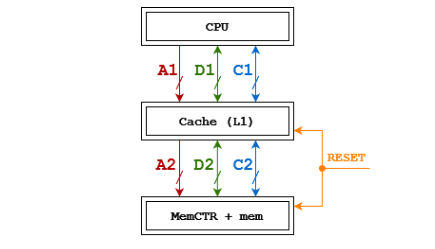

# proc-cache
Здесь можно найти моделирование работы кэша процессора в двух вариантах: с политикой вытеснения LRU и bit-pLRU. Реализованную модель можно использовать для определения процента попаданий и общего времени (в тактах), затраченного на выполнение симулируемой программы.

Данные материалы созданы в рамках [Лабораторной работы курса архитектуры ЭВМ](https://docs.google.com/document/d/1E2JM_H5ihhbRT28hHgiqIqx5WkjHefm6gGk62HK9zVI/edit).

